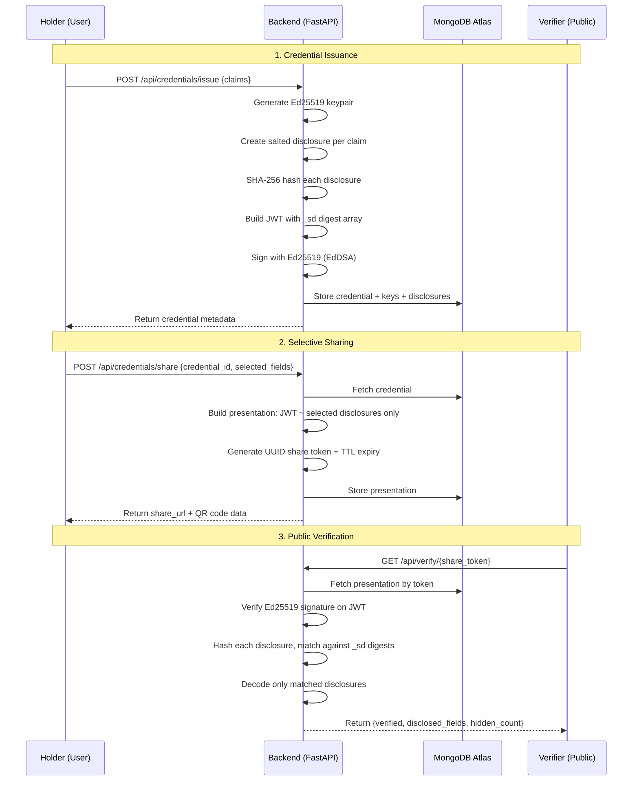

# CyStar — Selective Disclosure & Verification Module

     

**IETF SD-JWT based selective disclosure and credential verification system.**

> Built for CyStar Summer Internship Assessment — IIT Madras

---

## Live Demo

| Component | URL |
|-----------|-----|
| Frontend  | [cystar-selective-disclosure.vercel.app](https://cystar-selective-disclosure.vercel.app) |
| Backend   | [cystar-selective-disclosure.onrender.com](https://cystar-selective-disclosure.onrender.com) |
| API Docs  | [Swagger UI](https://cystar-selective-disclosure.onrender.com/docs) |

> Free-tier Render instances spin down after inactivity. First request may take ~30s.

---

## Architecture



---

## Tech Stack

| Layer | Technology |
|-------|-----------|
| Frontend | Next.js 16, TypeScript, Tailwind CSS, shadcn/ui, Sonner, qrcode.react |
| Backend | FastAPI, Pydantic v2, Motor (async MongoDB), SlowAPI |
| Database | MongoDB Atlas (M0 free tier) |
| Cryptography | Ed25519 (PyNaCl), SHA-256, IETF SD-JWT (custom implementation) |
| Authentication | JWT (python-jose), bcrypt (passlib) |
| Infrastructure | Docker Compose, GitHub Actions CI |
| Deployment | Vercel (frontend), Render (backend) |

---

## SD-JWT: How It Works

### 1. Issuance

Each claim in a credential is individually processed:

```
claim: "name" = "Vishnu Aravind"
  -> generate random salt
  -> disclosure = base64url(json([salt, "name", "Vishnu Aravind"]))
  -> hash = SHA-256(disclosure)
  -> store hash in JWT payload under _sd array
  -> sign entire JWT with Ed25519 private key
```

The JWT contains only hashes, not actual values. Actual values live in separate disclosure strings.

### 2. Selective Sharing

The holder chooses which fields to reveal:

```
SD-JWT: header.payload.signature
Presentation: SD-JWT ~ disclosure_name ~ disclosure_degree ~
                       (only selected disclosures appended)
```

Hidden fields have no disclosure attached — the verifier sees the hash in `_sd` but cannot reverse it.

### 3. Verification

The verifier receives the presentation and:

1. Splits into JWT + disclosures
2. Verifies Ed25519 signature on the JWT (tamper detection)
3. Hashes each disclosure and checks against `_sd` digests (integrity)
4. Decodes matched disclosures to extract claim values
5. Reports: disclosed fields, hidden count, issuer, issue date

If the signature fails or a disclosure hash doesn't match `_sd`, verification fails.

---

## Features

- **Register / Login** — JWT-based authentication with bcrypt password hashing
- **Issue Credentials** — Create verifiable credentials with arbitrary custom claims
- **Selective Disclosure** — Field-level checkboxes to choose exactly what to reveal
- **QR Code + Link** — Share credentials via scannable QR or copyable URL
- **Public Verification** — Anyone with the link can verify without logging in
- **Ed25519 Signatures** — Tamper-evident digital signatures on every credential
- **Rate Limiting** — Verification endpoint capped at 10 requests/minute per IP
- **Auto-Expiry** — Share links expire via MongoDB TTL indexes
- **Dark UI** — Responsive, mobile-friendly interface built with Tailwind + shadcn/ui

---

## Project Structure

```
cystar-selective-disclosure/
├── backend/
│   ├── app/
│   │   ├── main.py                  # FastAPI app, CORS, routers
│   │   ├── core/
│   │   │   ├── config.py            # Pydantic settings
│   │   │   ├── database.py          # Motor MongoDB client
│   │   │   ├── security.py          # JWT + bcrypt
│   │   │   └── exceptions.py        # Custom error handling
│   │   ├── auth/
│   │   │   ├── router.py            # /register, /login
│   │   │   ├── service.py           # Auth business logic
│   │   │   ├── repository.py        # User CRUD
│   │   │   └── schemas.py           # Request/response models
│   │   ├── credentials/
│   │   │   ├── router.py            # /issue, /share, /list
│   │   │   ├── service.py           # Credential business logic
│   │   │   ├── repository.py        # Credential + presentation CRUD
│   │   │   ├── schemas.py           # Request/response models
│   │   │   └── crypto/
│   │   │       ├── sd_jwt.py        # SD-JWT create/verify
│   │   │       ├── ed25519.py       # Ed25519 sign/verify
│   │   │       └── utils.py         # Base64url, SHA-256, disclosures
│   │   ├── verification/
│   │   │   ├── router.py            # GET /verify/{token}
│   │   │   ├── service.py           # Verification logic
│   │   │   └── schemas.py           # Response model
│   │   └── middleware/
│   │       └── rate_limiter.py      # SlowAPI config
│   ├── tests/
│   │   └── test_sd_jwt.py           # 12 unit tests
│   ├── requirements.txt
│   ├── Dockerfile
│   └── .env.example
├── frontend/
│   ├── src/
│   │   ├── app/
│   │   │   ├── page.tsx             # Landing page
│   │   │   ├── layout.tsx           # Root layout + AuthProvider
│   │   │   ├── (auth)/
│   │   │   │   ├── login/page.tsx
│   │   │   │   └── register/page.tsx
│   │   │   ├── (protected)/
│   │   │   │   ├── layout.tsx       # Navbar + auth guard
│   │   │   │   ├── dashboard/page.tsx
│   │   │   │   ├── issue/page.tsx
│   │   │   │   └── share/[id]/page.tsx
│   │   │   └── verify/[token]/page.tsx  # Public verification
│   │   ├── lib/
│   │   │   ├── api-client.ts        # Axios + interceptors
│   │   │   └── auth-context.tsx     # Auth state management
│   │   └── types/index.ts           # TypeScript interfaces
│   ├── package.json
│   ├── Dockerfile
│   └── vercel.json
├── docker-compose.yml
└── .github/workflows/ci.yml
```

---

## API Documentation

| Method | Endpoint | Auth | Description |
|--------|----------|------|-------------|
| `POST` | `/api/auth/register` | No | Register new user |
| `POST` | `/api/auth/login` | No | Login, get JWT token |
| `POST` | `/api/credentials/issue` | Yes | Issue a new credential |
| `GET`  | `/api/credentials/` | Yes | List user credentials |
| `POST` | `/api/credentials/share` | Yes | Create selective disclosure share link |
| `GET`  | `/api/verify/{share_token}` | No | Verify a shared credential (rate-limited) |
| `GET`  | `/health` | No | Health check |

Full interactive docs: [Swagger UI](https://cystar-selective-disclosure.onrender.com/docs)

---

## Environment Variables

### Backend (`backend/.env`)

| Variable | Description | Example |
|----------|-------------|---------|
| `MONGODB_URL` | MongoDB Atlas connection string | `mongodb+srv://...` |
| `DATABASE_NAME` | Database name | `cystar` |
| `JWT_SECRET` | Secret key for JWT signing | `your-secret-key` |
| `JWT_ALGORITHM` | JWT algorithm | `HS256` |
| `JWT_EXPIRY_MINUTES` | Token expiry in minutes | `60` |
| `FRONTEND_URL` | Frontend URL for CORS | `https://cystar-selective-disclosure.vercel.app` |

### Frontend (`frontend/.env.local`)

| Variable | Description | Example |
|----------|-------------|---------|
| `NEXT_PUBLIC_API_URL` | Backend API URL | `https://cystar-selective-disclosure.onrender.com` |

---

## Testing

```bash
cd backend
pytest tests/test_sd_jwt.py -v
```

**12 tests covering:**

- Ed25519 key generation, signing, verification
- Disclosure creation, hashing, decoding
- Full SD-JWT lifecycle
- Selective disclosure (reveal 2 of 5 fields)
- Tamper detection
- Wrong key rejection
- Issuer metadata preservation

---

## Security

| Mechanism | Implementation |
|-----------|---------------|
| Digital Signatures | Ed25519 (EdDSA) via PyNaCl — 128-bit security level |
| Disclosure Hashing | SHA-256 with unique random salt per claim |
| Password Storage | bcrypt via passlib — no plaintext storage |
| Authentication | JWT with configurable expiry |
| Link Expiry | MongoDB TTL indexes auto-delete expired presentations |
| Rate Limiting | SlowAPI — 10 req/min on verification endpoint |
| CORS | Restricted to frontend origin |
| Secrets | Environment variables, `.env` excluded from version control |

---

## Architecture Decision: SD-JWT vs Alternatives

| Approach | Pros | Cons | Decision |
|----------|------|------|----------|
| **SD-JWT (chosen)** | IETF draft standard, simple, field-level disclosure, compact | Not ZKP, correlatable tokens | Selected |
| Merkle Trees | Efficient batch proofs | Complex implementation, no formal spec | Rejected |
| BBS+ Signatures | True ZKP, unlinkable proofs | Complex crypto, limited Python support | Future enhancement |
| W3C VC + JSON-LD | Industry standard | Heavy spec, complex parsing | Over-engineered for scope |

---

## What I Would Improve

- **BBS+ Signatures** — Zero-knowledge proofs for unlinkable presentations
- **DID Integration** — Decentralized identifiers for issuer/holder identity
- **Revocation Registry** — Allow issuers to revoke credentials
- **HSM Key Storage** — Hardware security modules for production key management
- **WebAuthn** — Passwordless authentication with FIDO2
- **Credential Schema Registry** — Standardized claim schemas (OpenBadges v3)
- **Audit Logging** — Immutable log of all issuance and verification events
- **Multi-Issuer Support** — Multiple organizations issuing credentials
- **Batch Verification** — Verify multiple credentials in one request
- **Mobile App** — React Native companion app with biometric auth

---

## License

MIT

---

*Built by Vishnu Aravind for CyStar — IIT Madras*